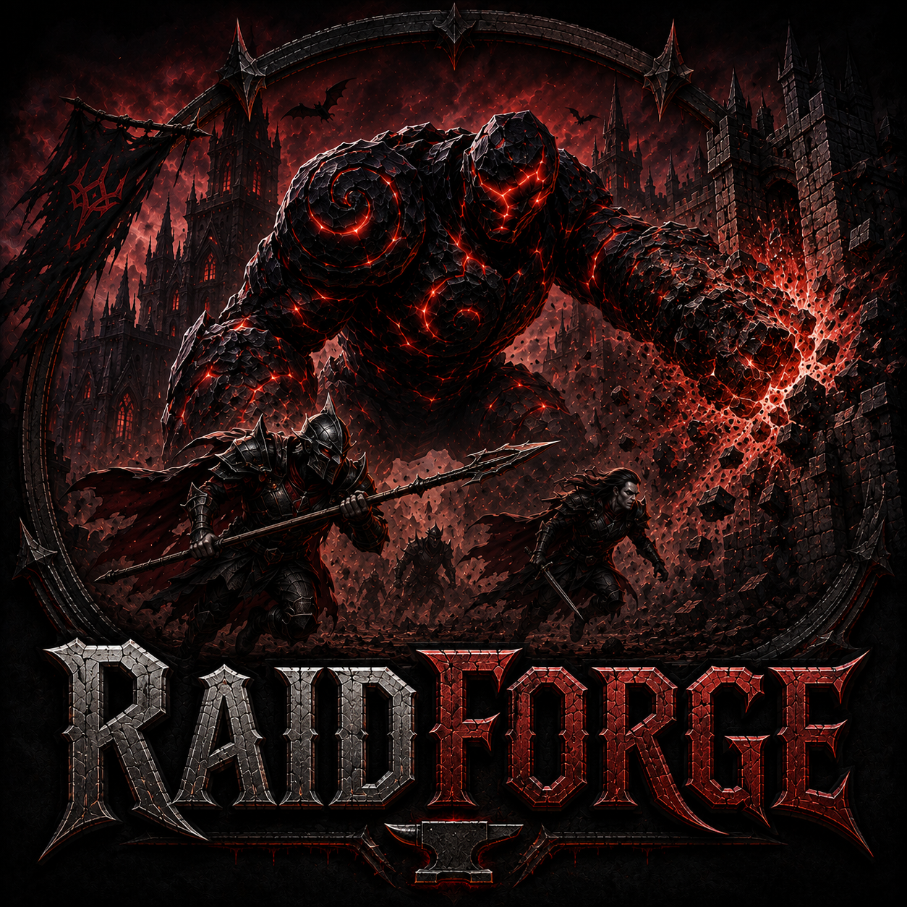

<p align="center">
  
</p>

# RaidForge

RaidForge is a server-side V Rising mod for configurable raid schedules, offline base protection, opt-in raiding, purchased protection, weapon raiding, raid interference, map alerts, Siege Golem automation, Soul Shard rules, and per-castle servant limits.

Current mod version: **3.1.1**

> [!IMPORTANT]
> RaidForge changes important combat and castle-protection rules. Back up your world and configuration files before installing or updating it, and validate changes on a test server first.

## What's New

- **Per-castle servant limits:** Limit selected convertible characters independently for each castle heart.
- **Validated servant mappings:** RaidForge reads the game's `ServantConvertable.ConvertToUnit` data instead of relying on guessed regular-to-servant names.
- **Safe coffin rejection:** Excess Insert actions are stopped before the dominated NPC is consumed.
- **Shared base enforcement:** Every clan member using the same castle heart shares that base's servant count, while another castle heart has its own count.
- **Clear and throttled feedback:** Rejected players receive a simple system message, limited to one notice every five seconds.
- **Lightweight diagnostics:** Detailed servant action/count logging is optional and disabled by default.
- **Purchased ORP:** Players can purchase protection for upcoming configured raid days using a server-selected currency.
- **Expanded schedules and controls:** Day-based ORP, opt-in schedules, schedule clock offsets, manual raid overrides, and live configuration tools.
- **Improved ownership and damage handling:** RaidForge uses direct damage interception and owner-aware clan/base evaluation for raid decisions.

## Requirements

- A V Rising dedicated server
- BepInEx 6 for IL2CPP
- HookDOTS.API
- VampireCommandFramework

RaidForge is server-side. Players do not need to install the mod locally.

This source tree expects the following locally supplied build dependencies:

```text
libs/HookDOTS.API.dll
libs/VampireCommandFramework.dll
```

Those third-party binaries are intentionally not stored in this repository.

## Installation

1. Stop the dedicated server and back up its save and configuration directories.
2. Install BepInEx, HookDOTS.API, and VampireCommandFramework.
3. Copy `RaidForge.dll` into `BepInEx/plugins/`.
4. Start the server once so RaidForge can create its configuration files.
5. Stop the server, review `BepInEx/config/RaidForge/`, and enable only the systems you intend to use.
6. Restart the server and verify the startup log.

If RaidForge controls your raid schedule, disable conflicting vanilla raid-hour settings. Running both scheduling systems can produce overlapping or unexpected raid windows.

## Feature Overview

### Raid Scheduling and Administration

- Define daily raid windows, including windows that cross midnight.
- Apply a display offset to RaidForge's schedule clock.
- Allow or prevent Waygate travel during an active global raid window.
- Force raids on or off temporarily, then return control to the automatic schedule.
- Inspect loaded configuration, runtime state, and cached owner/base counts through admin commands.
- Reload RaidForge configuration files without a full server restart.

### Offline Raid Protection

- Protects a castle when all associated defenders are offline.
- Evaluates the castle owner or clan rather than only the last player who touched the base.
- Supports a configurable logout grace period so logging out during danger does not immediately protect a castle.
- Optionally restricts ORP to selected days of the week.
- Can announce eligible offline or decayed-base raids with cooldowns to prevent chat spam.
- Can make Soul Shard owners ineligible for Offline Raid Protection.

Offline Raid Protection takes priority if it and Opt-In Raiding are accidentally enabled together.

### Opt-In Raiding

- Allows players and clans to choose whether their bases are raidable.
- Supports default opted-in or opted-out server policies.
- Enforces mutual participation when configured: an attacker must also be opted in before damaging an opted-in defender.
- Includes opt-state lock durations, scheduled opt-in days, optional automatic opt-out, and automatic handling for Soul Shard holders.
- Opt status is stored by persistent owner identity so clan members share the same result.

### Purchased Offline Protection

- Players can buy protection with `.buyorp <days>`.
- Each purchased unit represents one configured raid-day credit.
- Non-raid days do not consume credits.
- The currency prefab, display name, price per raid day, and maximum purchase are configurable.
- Protection is stored by the player or clan owner key, so clan-owned bases share the same balance.
- Administrators can grant or remove credits.

Purchased ORP is intended as its own protection mode. Standard Offline Raid Protection and Opt-In Raiding should be disabled when it is used.

### Weapon Raiding and Siege Golems

- Allows configured weapons and explosives to damage stone structures without requiring a Siege Golem.
- Applies a configurable stone-structure damage multiplier.
- Can automatically change Siege Golem health as the server ages.
- Supports a persistent manual health override and commands for inspecting available levels.
- Includes an admin command for transforming a player into a Siege Golem.

### Raid Interference

- Detects third parties entering an active siege who are neither attackers nor defenders.
- Applies an interference burn to discourage outside participation.
- Supports exemptions for administrators and Bear Form.
- Can disable interference handling for offline or decaying bases.

### Map Alerts

- Optional icons for eligible offline-base and decayed-base raids.
- Optional passive icons for opted-in and opted-out bases.
- Configurable icon prefab selection and duration after the last eligible raid hit.
- Includes an admin command to clear active RaidForge icons.

### Soul Shard Rules

- Configure the maximum allowed count for each tracked Soul Shard type.
- Optionally revoke Offline Raid Protection from an owner or clan holding a tracked shard.
- Shard ownership is refreshed against live world state.

## Per-Castle Servant Limits

Servant limits are configured in `ServantLimits.cfg`. On world initialization, RaidForge discovers every regular `CHAR_` prefab that the game marks as convertible and creates a blank entry for it.

The control settings appear at the top of the file:

```ini
[00 - General]

EnableServantLimits = false
EnableDetailedLogging = false
```

Both settings are disabled by default for new installations.

Under `[Character Limits]`, blank entries are unlimited:

```ini
CHAR_Militia_Longbowman =
```

Set a non-negative number to create a per-castle maximum:

```ini
CHAR_Militia_Longbowman = 2
```

Use `0` to block that character type completely:

```ini
CHAR_Militia_Longbowman = 0
```

Important behavior:

- Configure the regular captured character, not the final `_Servant` prefab.
- RaidForge resolves the final servant prefab from the game's conversion component.
- Counts are isolated by `CastleHeartConnection`. Every clan member using the same base shares the same count.
- A coffin connected to another castle heart belongs to a different base and has an independent count.
- Converting, alive, mission-assigned, dead/revivable, and reviving servants count because their occupied coffin remains connected to the castle.
- A short pending reservation prevents two simultaneous Insert actions from bypassing the same limit.
- Rejection occurs before the dominated NPC is consumed.
- The player sees: `This castle has reached the maximum number of <type> servants.`

The limiter is event-driven. It runs only for relevant servant coffin Insert actions, scans the server's servant-coffin set, and counts only occupied coffins connected to the interacted castle heart. It does not run every frame.

When `EnableDetailedLogging = false`, per-action mapping, coffin, count, reservation, and allow/block diagnostics are skipped. Startup summaries and genuine warnings or errors may still be logged.

## Configuration Files

RaidForge creates these files under `BepInEx/config/RaidForge/`:

- `RaidScheduleAndGeneral.cfg` — Raid windows, schedule display/offset, Waygate policy, and raid-status display options.
- `OfflineProtection.cfg` — ORP toggle, day schedule, logout grace period, and raid announcements.
- `OptInRaiding.cfg` — Opt-in defaults, locks, automatic state changes, and shard-holder behavior.
- `OptInSchedule.cfg` — Days when the Opt-In system is allowed or overridden.
- `PurchasedORP.cfg` — Purchased protection, currency, price, display name, and purchase maximum.
- `WeaponRaiding.cfg` — Weapon raiding and stone-structure multiplier.
- `RaidInterference.cfg` — Third-party interference and exemptions.
- `MapIcons.cfg` — Offline, decay, opt-in, and opt-out map icon behavior.
- `ServantLimits.cfg` — Generated convertible-character limits per castle.
- `SoulShards.cfg` — Shard count rules and ORP eligibility.
- `GolemSettings.cfg` — Day-based Siege Golem health automation and overrides.
- `Troubleshooting.cfg` — Verbose RaidForge diagnostics. Keep this disabled unless actively troubleshooting.

Use `.reloadraidforge` after editing configuration files. Review the server log to confirm that the new values were accepted.

## Commands

RaidForge commands use the configured RaidForge schedule clock and display label, not the player's local client clock.

### Player Commands

- `.raidt` / `.raidtimer` — Show whether raids are active or the time until the next raid window.
- `.raiddays` / `.raidd` — Display the weekly raid schedule.
- `.raidstatus <PlayerName>` / `.raids <PlayerName>` — Display a player or clan's raid vulnerability status.
- `.raidoptin` — Opt the player or clan into raiding when Opt-In Raiding is active.
- `.raidoptout` — Opt out after the configured lock and schedule checks pass.
- `.raidoptstatus` — Show the current opt status and remaining lock time.
- `.raidoptlist [page]` — List manually opted-in owners.
- `.buyorp <days>` — Purchase configured raid-day protection.
- `.buyorpstatus` / `.orpamount` — Show remaining purchased ORP raid days.

### Administrator Commands

- `.reloadraidforge` — Reload all RaidForge configuration files.
- `.raidon` / `.raidoff` — Force the global raid state on or off.
- `.raidauto` — Clear the manual override and resume the configured schedule.
- `.raidstatusreason <PlayerName>` — Explain an owner's ORP decision.
- `.removeorp <PlayerName>` — Remove ORP until that owner reconnects.
- `.forceopt <PlayerName> <in|out>` — Force a player or clan's opt state.
- `.givebuyorp <PlayerName> <amount>` — Grant purchased ORP credits.
- `.removebuyorp <PlayerName> <amount>` — Remove purchased ORP credits.
- `.clearraidforgeicons` — Clear all active RaidForge map icons.
- `.golemstartdate` — Set the Siege Golem automation start time.
- `.golemcurrent` — Display the current Siege Golem health settings.
- `.golemsethp <LevelName>` — Persist a manual Siege Golem health level.
- `.golemauto` — Clear the manual Golem override and resume automation.
- `.golemlist` — List available Siege Golem health levels.
- `.golem [PlayerName]` — Transform the target or issuing administrator into a Siege Golem.
- `.raidrefreshcache` — Rebuild RaidForge's owner, player, and castle caches.
- `.raidforge ?` / `.raidforge status` / `.raidforge cache` — Show RaidForge help, status, and cached counts.
- `.raidconfigview ?` / `.raidconfigview <number>` — Display a specific loaded configuration section.
- `.raidconfigviewall` — Display all loaded RaidForge configuration values.

## Building from Source

1. Install the .NET 6 SDK.
2. Place compatible HookDOTS.API and VampireCommandFramework DLLs in `libs/`.
3. From the repository root, run:

```powershell
dotnet build RaidForge.sln -c Release
```

The compiled mod is written to `bin/Release/net6.0/RaidForge.dll`.

## Bugs and Support

Bugs and edge cases can happen. If you find one, please report it so it can be reproduced and resolved.

Open a ticket or use the appropriate support channel in the [V Rising Modding Community Discord](https://vrisingmods.com/discord). Include:

- RaidForge version
- V Rising dedicated-server version
- A clear description of what happened and what you expected
- Reproduction steps
- Relevant RaidForge configuration values
- The matching section of `BepInEx/LogOutput.log`

Do not include passwords, authentication tokens, private server credentials, or an entire save file in a public report.

You may also contact **Darrean (inility#4118)** for RaidForge-specific support.

## Disclaimer

RaidForge is an unofficial community-made mod. It is not affiliated with, endorsed by, sponsored by, or officially supported by Stunlock Studios or the V Rising team. V Rising and related names and marks belong to their respective owners.

Use RaidForge at your own risk. Mods can conflict, game or dependency updates can change behavior, and bugs may affect gameplay or server state. Maintain backups and test configuration changes before using them on a production server. Please report RaidForge issues through the mod-support process above rather than to official V Rising support.

## Special Thanks

Special thanks to the following players for testing, feedback, ideas, bug reports, and other help:

- **helskog**
- **Mitch (zfolmt)**
- **Amingo**
- **Thiaz**

Developer: **Darrean (inility#4118)**

## License and Use

RaidForge is provided for non-commercial use. You may use, modify, and redistribute the project, but you may not sell the mod or derivative works. The software is provided as-is and without warranty.
